# 图像处理从入门到精通：一份全面的技术指南

> 在数字化时代，图像处理技术无处不在——从手机拍照到医学影像，从自动驾驶到工业检测。本文将带你系统了解图像处理的核心知识体系，从基础概念到经典算法，从理论原理到代码实践。

---

## 一、图像处理全景图：从传统方法到 AI 驱动

图像处理是一个庞大的技术体系，让我们先看完整的处理流程：

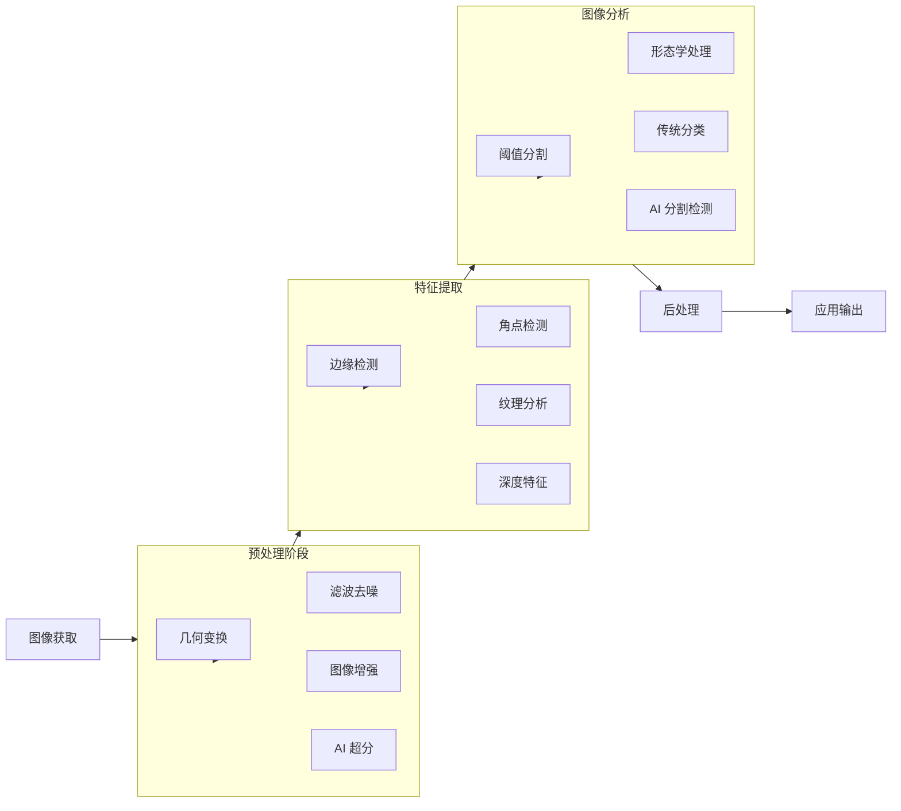

### 1.1 图像处理基础概念

图像数字化包含两个关键步骤：**空间采样**确定像素位置，**灰度量化**确定像素值。

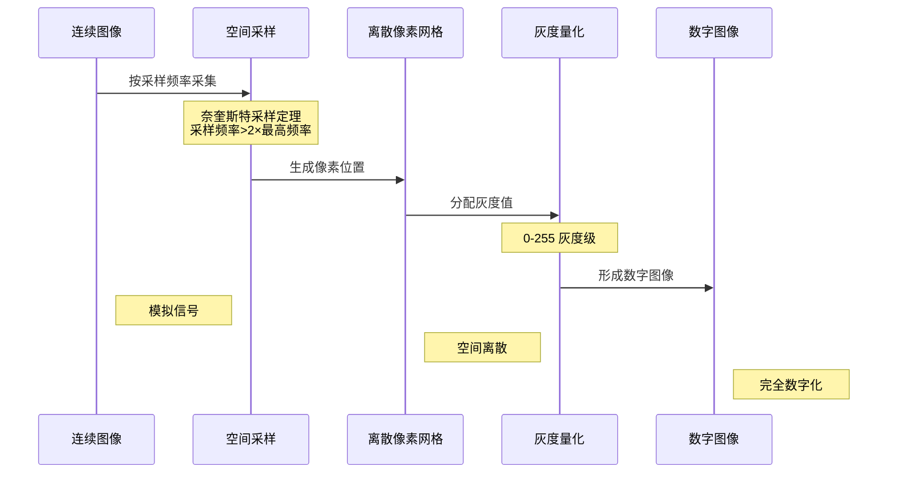

### 1.2 图像类型对比

| 图像类型 | 像素表示 | 数据量 | 典型应用 | 优点 |
|---------|---------|-------|---------|------|
| 二值图像 | 0 或 1 | 1 bit/像素 | 文档扫描、OCR | 数据量极小，处理简单 |
| 灰度图像 | 0-255 | 8 bit/像素 | 医学影像、工业检测 | 保留亮度信息，计算效率高 |
| RGB 彩色图像 | (R,G,B) | 24 bit/像素 | 摄影、显示 | 符合人眼感知，色彩丰富 |
| 多光谱图像 | 多波段数据 | 可变 | 遥感、农业监测 | 包含不可见光信息 |
| 深度图像 | 距离值 | 16-32 bit/像素 | 3D 重建、机器人导航 | 包含空间深度信息 |
| NeRF | 隐式表示 | 紧凑 | VR/AR、3D 内容 | 高质量新视角合成 |
| 3D 高斯泼溅 | 3D 高斯分布 | 中等 | 实时 3D 渲染 | 实时渲染、易编辑 |

### 1.3 色彩模型转换关系

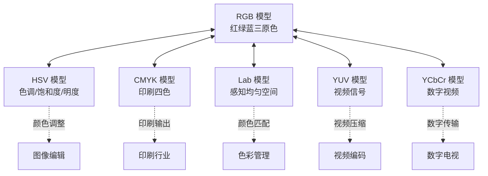

---

## 二、图像处理算法分类体系

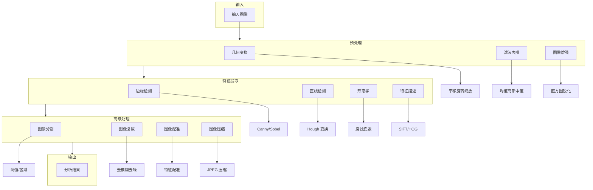

### 2.1 推荐学习路径

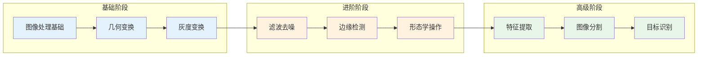

---

## 三、核心算法详解

### 3.1 几何变换

几何变换是图像处理的基础操作，包括平移、旋转、缩放、仿射变换和透视变换。

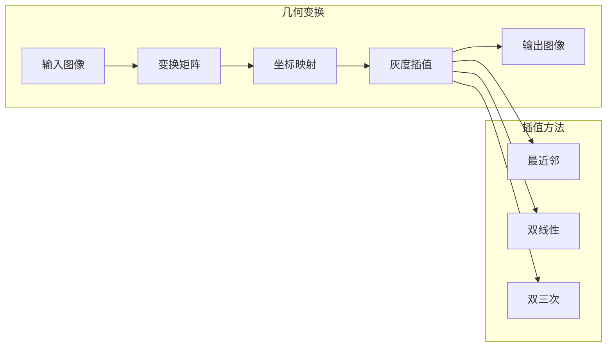

**常见变换类型对比：**

| 变换类型 | 自由度 | 保持性质 |
|---------|-------|---------|
| 平移 | 2 (tx, ty) | 形状、大小、方向 |
| 旋转 | 1 (角度) | 形状、大小 |
| 缩放 | 2 (sx, sy) | 形状（均匀缩放） |
| 仿射变换 | 6 | 平行线 |
| 透视变换 | 8 | 直线 |

---

### 3.2 滤波算法：图像去噪的核心技术

滤波是图像预处理的关键步骤，用于去除噪声、平滑图像或增强特定特征。

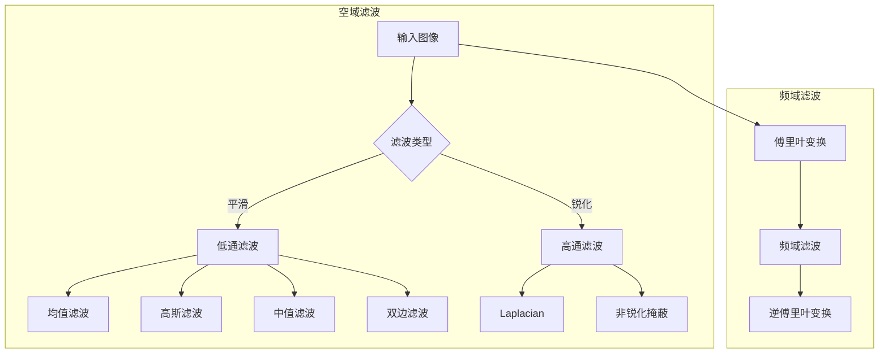

#### 3.2.1 滤波器对比

| 滤波器 | 原理 | 优点 | 缺点 | 适用场景 |
|-------|------|------|------|---------|
| 均值滤波 | 邻域平均 | 简单快速 | 边缘模糊 | 轻度噪声 |
| 高斯滤波 | 加权平均 | 保边效果好 | 参数敏感 | 高斯噪声 |
| 中值滤波 | 排序取中值 | 保护边缘 | 计算量大 | 椒盐噪声 |
| 双边滤波 | 空间 + 灰度加权 | 保边去噪 | 速度慢 | 精细图像 |

#### 3.2.2 高斯滤波详解

高斯滤波是一种线性滤波技术，使用高斯函数作为权重对图像进行平滑处理。

**算法流程：**

```mermaid
flowchart LR
    A[输入图像] --> B[生成高斯核<br/>G(x,y) = (1/2πσ²)e^(-(x²+y²)/2σ²)]
    B --> C[加权卷积<br/>中心权重高，边缘权重低]
    C --> D[输出平滑图像<br/>保留边缘信息]

    subgraph 高斯核示例 (σ=1)
        E[1 2 1<br/>2 4 2<br/>1 2 1]
    end

    B -.-> E
```

**高斯滤波 Python 实现：**

```python
import cv2
import numpy as np

def gaussian_filter(image_path, kernel_size=5, sigma=1.0):
    """使用 OpenCV 实现高斯滤波"""
    img = cv2.imread(image_path)
    filtered = cv2.GaussianBlur(img, (kernel_size, kernel_size), sigma)
    return img, filtered

def create_gaussian_kernel(size, sigma):
    """创建高斯核"""
    kernel = np.zeros((size, size), dtype=np.float32)
    center = size // 2
    
    for i in range(size):
        for j in range(size):
            x, y = i - center, j - center
            kernel[i, j] = np.exp(-(x**2 + y**2) / (2 * sigma**2))
    
    # 归一化
    kernel = kernel / np.sum(kernel)
    return kernel
```

---

### 3.3 边缘检测：Canny 算法详解

边缘检测是图像特征提取的核心技术，Canny 算法被公认为最优的边缘检测方法。

#### 3.3.1 Canny 算法三标准

Canny 在 1986 年提出了评价边缘检测算法的三个标准：

- **低错误率**：不漏检、不误检
- **定位准确**：边缘点接近真实中心
- **单一响应**：单边缘单响应

#### 3.3.2 Canny 算法流程

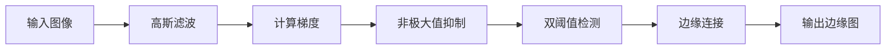

#### 3.3.3 详细步骤序列图

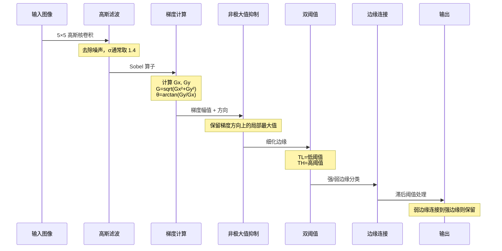

#### 3.3.4 Canny 算法 Python 实现

```python
import cv2
import numpy as np
import matplotlib.pyplot as plt

def canny_edge_detection(image_path, low_threshold=50, high_threshold=150):
    """
    使用 OpenCV 实现 Canny 边缘检测
    :param image_path: 输入图像路径
    :param low_threshold: 低阈值
    :param high_threshold: 高阈值
    :return: 原图和边缘检测结果
    """
    img = cv2.imread(image_path)
    gray = cv2.cvtColor(img, cv2.COLOR_BGR2GRAY)
    
    # 应用 Canny 边缘检测
    edges = cv2.Canny(gray, low_threshold, high_threshold)
    
    return img, edges

# 使用示例
img, edges = canny_edge_detection('image.jpg', 50, 150)
```

#### 3.3.5 Canny 算法优缺点

**优点：**
- 边缘检测精度高
- 对噪声具有较好的鲁棒性
- 边缘连续性好
- 参数相对较少，易于调节
- 理论基础扎实

**缺点：**
- 计算复杂度较高
- 参数选择需要经验
- 对弱边缘可能漏检

---

### 3.4 Hough 变换：直线检测的投票算法

Hough 变换是一种基于参数空间投票的几何形状检测方法，由 Paul Hough 于 1962 年提出。

#### 3.4.1 核心原理：点 - 线对偶性

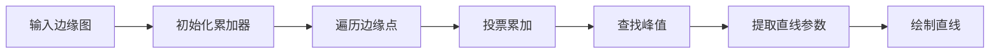

**直线极坐标表示：**

```
ρ = x · cos(θ) + y · sin(θ)
```

其中：
- ρ (rho)：直线到原点的垂直距离
- θ (theta)：垂线与 x 轴的夹角

#### 3.4.2 Hough 变换算法流程

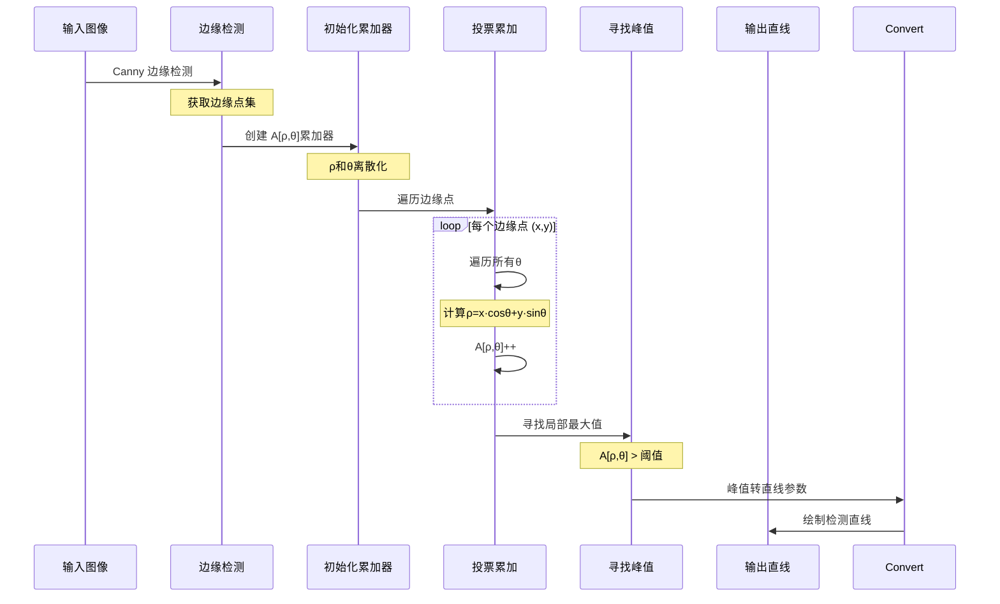

#### 3.4.3 投票过程可视化

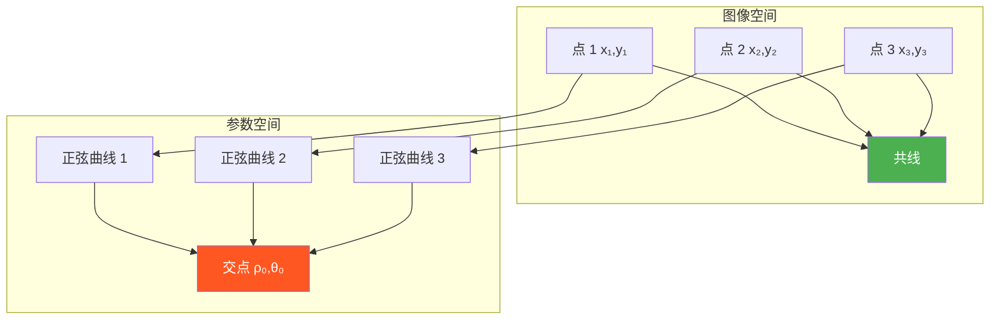

#### 3.4.4 Hough 变换 Python 实现

```python
import cv2
import numpy as np
import matplotlib.pyplot as plt

def hough_line_transform(image_path, threshold=100):
    """使用 OpenCV 实现标准 Hough 变换"""
    img = cv2.imread(image_path)
    gray = cv2.cvtColor(img, cv2.COLOR_BGR2GRAY)
    
    # 边缘检测
    edges = cv2.Canny(gray, 50, 150, apertureSize=3)
    
    # 使用 HoughLines 检测直线
    lines = cv2.HoughLines(edges, 1, np.pi/180, threshold)
    
    # 在原图上绘制检测到的直线
    img_with_lines = img.copy()
    if lines is not None:
        for rho, theta in lines[:, 0]:
            a = np.cos(theta)
            b = np.sin(theta)
            x0 = a * rho
            y0 = b * rho
            x1 = int(x0 + 1000 * (-b))
            y1 = int(y0 + 1000 * (a))
            x2 = int(x0 - 1000 * (-b))
            y2 = int(y0 - 1000 * (a))
            cv2.line(img_with_lines, (x1, y1), (x2, y2), (0, 0, 255), 2)
    
    return img, img_with_lines

def probabilistic_hough_transform(image_path, threshold=50,
                                   min_line_length=50, max_line_gap=10):
    """使用概率 Hough 变换检测直线"""
    img = cv2.imread(image_path)
    gray = cv2.cvtColor(img, cv2.COLOR_BGR2GRAY)
    
    # 边缘检测
    edges = cv2.Canny(gray, 50, 150, apertureSize=3)
    
    # 使用概率 Hough 变换检测直线
    lines = cv2.HoughLinesP(edges, 1, np.pi/180, threshold,
                           minLineLength=min_line_length,
                           maxLineGap=max_line_gap)
    
    img_with_lines = img.copy()
    if lines is not None:
        for x1, y1, x2, y2 in lines[:, 0]:
            cv2.line(img_with_lines, (x1, y1), (x2, y2), (0, 255, 0), 2)
    
    return img, img_with_lines
```

#### 3.4.5 Hough 变换优缺点

**优点：**
- 对噪声具有一定的鲁棒性
- 能够检测不完整或断裂的直线
- 可以同时检测多条直线
- 参数化表示便于后续处理
- 可扩展到检测圆、椭圆等形状

**缺点：**
- 计算复杂度较高，特别是对于大图像
- 需要合适的参数设置
- 对于密集的边缘图像，可能会产生虚假检测
- 内存消耗较大（需要累加器数组）

---

### 3.5 形态学操作

形态学操作是基于形状的图像处理方法，广泛应用于图像预处理和后处理。

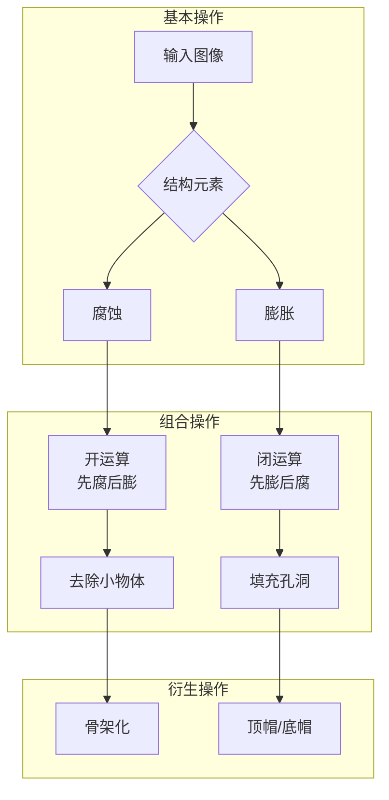

**操作效果对比：**

| 操作 | 效果 | 应用 |
|------|------|------|
| 腐蚀 | 缩小前景 | 分离物体、去噪 |
| 膨胀 | 扩大前景 | 填补空洞、连接 |
| 开运算 | 平滑轮廓 | 去除小突起 |
| 闭运算 | 填充孔洞 | 连接断裂 |

---

### 3.6 图像分割算法

图像分割是将图像划分为多个有意义区域的关键技术。

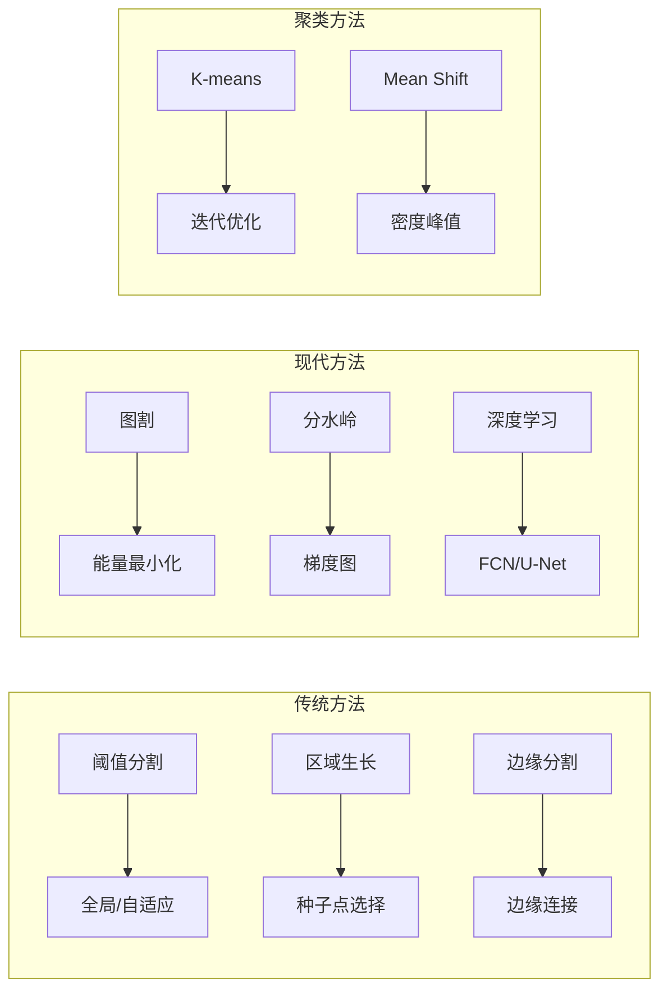

**分割算法对比：**

| 算法 | 原理 | 优点 | 缺点 | 复杂度 |
|------|------|------|------|-------|
| Otsu | 最大类间方差 | 自动阈值 | 双峰假设 | O(L) |
| K-means | 聚类迭代 | 简单高效 | 需指定 K | O(nK) |
| 分水岭 | 拓扑理论 | 分割完整 | 过分割 | O(nlogn) |
| 图割 | 图论优化 | 全局最优 | 计算量大 | O(n³) |
| U-Net | 深度学习 | 精度最高 | 需训练数据 | 推理快 |

---

## 四、算法性能对比

| 算法类别 | 代表算法 | 时间复杂度 | 空间复杂度 | 实时性 | 精度 |
|---------|---------|-----------|-----------|-------|------|
| 几何变换 | 仿射变换 | O(M×N) | O(M×N) | ✅ | ✅ |
| 空域滤波 | 高斯滤波 | O(M×N×k²) | O(k²) | ✅ | ✅ |
| 边缘检测 | Canny | O(M×N) | O(M×N) | ⚠️ | ✅ |
| Hough 变换 | 标准 Hough | O(N×Θ) | O(Ρ×Θ) | ❌ | ✅ |
| 形态学 | 腐蚀/膨胀 | O(M×N×k²) | O(k²) | ✅ | ✅ |
| 图像分割 | K-means | O(n×K×T) | O(n) | ⚠️ | ⚠️ |

> 说明：M×N 为图像尺寸，k 为卷积核大小，Θ为角度采样数，Ρ为距离量化级数，K 为聚类数，T 为迭代次数

---

## 五、常见噪声模型与去噪方法

| 噪声类型 | 概率分布 | 产生原因 | 视觉特征 | 去噪方法 |
|---------|---------|---------|---------|---------|
| 高斯噪声 | 正态分布 | 电子电路热噪声 | 均匀分布的细颗粒 | 高斯滤波、维纳滤波 |
| 椒盐噪声 | 脉冲分布 | 信号传输错误 | 随机黑白点 | 中值滤波 |
| 泊松噪声 | 泊松分布 | 光子计数统计 | 与信号强度相关 | 方差稳定变换 |
| 乘性噪声 | 与信号相乘 | 相干成像系统 | 斑点状图案 | 同态滤波 |

---

## 六、图像质量指标关系

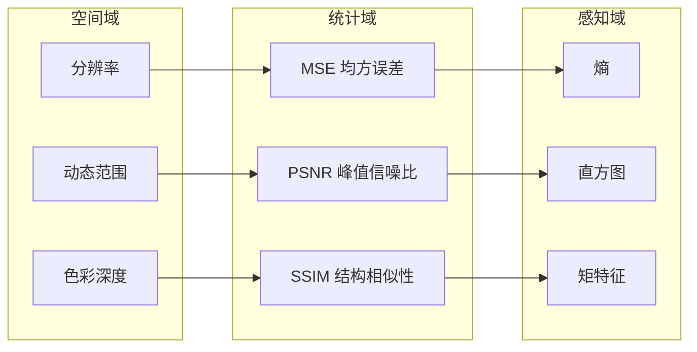

---

## 七、新技术趋势

### 7.1 深度学习模型

- **Vision Transformer (ViT)** - 替代 CNN 的主流架构
- **SAM (Segment Anything)** - 通用图像分割模型
- **扩散模型** - 图像生成和修复
- **NeRF/Gaussian Splatting** - 3D 场景重建

### 7.2 边缘计算与云处理

- **端侧 AI** - 手机/嵌入式设备实时处理
- **云边协同** - 分布式图像处理
- **联邦学习** - 隐私保护的模型训练
- **实时处理** - 4K/8K 视频流处理

---

## 八、实践代码示例

### 8.1 完整图像处理流程（Python）

```python
def complete_image_processing_pipeline(img_path):
    """
    完整的图像处理流程示例
    """
    # 1. 读取图像
    img = cv2.imread(img_path)
    img_rgb = cv2.cvtColor(img, cv2.COLOR_BGR2RGB)

    # 2. 预处理 - 去噪
    denoised = cv2.bilateralFilter(img, 9, 75, 75)

    # 3. 转换为灰度图
    gray = cv2.cvtColor(denoised, cv2.COLOR_BGR2GRAY)

    # 4. 增强对比度 - 直方图均衡化
    equalized = cv2.equalizeHist(gray)

    # 5. 边缘检测
    edges = cv2.Canny(equalized, 50, 150)

    # 6. 形态学操作 - 填充小孔洞
    kernel = np.ones((3, 3), np.uint8)
    dilated_edges = cv2.dilate(edges, kernel, iterations=2)
    eroded_edges = cv2.erode(dilated_edges, kernel, iterations=1)

    # 7. 查找轮廓
    contours, _ = cv2.findContours(
        eroded_edges, cv2.RETR_EXTERNAL, cv2.CHAIN_APPROX_SIMPLE
    )

    # 8. 绘制结果
    result = img_rgb.copy()
    cv2.drawContours(result, contours, -1, (0, 255, 0), 2)

    return {
        'original': img_rgb,
        'denoised': denoised,
        'gray': gray,
        'equalized': equalized,
        'edges': edges,
        'processed_edges': eroded_edges,
        'result': result,
        'contour_count': len(contours)
    }

# 使用示例
result = complete_image_processing_pipeline('sample.jpg')
print(f"检测到 {result['contour_count']} 个轮廓")
```

### 8.2 Golang 图像处理示例

```go
package main

import (
    "image"
    "image/jpeg"
    "os"
    "golang.org/x/image/draw"
)

// 高斯滤波核
var gaussianKernel = [][]float64{
    {1.0 / 16, 2.0 / 16, 1.0 / 16},
    {2.0 / 16, 4.0 / 16, 2.0 / 16},
    {1.0 / 16, 2.0 / 16, 1.0 / 16},
}

// 卷积操作
func convolve(img image.Image, kernel [][]float64) image.Image {
    bounds := img.Bounds()
    dst := image.NewRGBA(bounds)
    kernelSize := len(kernel)
    kernelCenter := kernelSize / 2

    for y := bounds.Min.Y; y < bounds.Max.Y; y++ {
        for x := bounds.Min.X; x < bounds.Max.X; x++ {
            var rSum, gSum, bSum float64

            for ky := 0; ky < kernelSize; ky++ {
                for kx := 0; kx < kernelSize; kx++ {
                    imgX := x + kx - kernelCenter
                    imgY := y + ky - kernelCenter
                    
                    // 边界处理
                    if imgX < bounds.Min.X {
                        imgX = bounds.Min.X + (bounds.Min.X - imgX)
                    } else if imgX >= bounds.Max.X {
                        imgX = bounds.Max.X - 1 - (imgX - bounds.Max.X)
                    }
                    
                    r, g, b, _ := img.At(imgX, imgY).RGBA()
                    weight := kernel[ky][kx]
                    rSum += float64(r>>8) * weight
                    gSum += float64(g>>8) * weight
                    bSum += float64(b>>8) * weight
                }
            }

            r := uint8(clamp(rSum, 0, 255))
            g := uint8(clamp(gSum, 0, 255))
            b := uint8(clamp(bSum, 0, 255))
            dst.Set(x, y, color.RGBA{r, g, b, 255})
        }
    }
    return dst
}
```

---

## 九、学习资源与建议

### 9.1 学习建议

1. **从基础开始**：先理解图像的数字化过程、色彩模型等基本概念
2. **动手实践**：通过 Python+OpenCV 或 Golang 实现各种算法
3. **理解原理**：不仅要会用，还要理解算法背后的数学原理
4. **项目驱动**：通过实际项目（如文档扫描、车牌识别）巩固知识

### 9.2 推荐工具

- **Python**: OpenCV, PIL/Pillow, scikit-image, matplotlib
- **Golang**: golang.org/x/image, go-opencv
- **在线资源**: 本教程网站提供完整的算法详解和代码示例

---

## 结语

图像处理是一门理论与实践并重的学科。从传统的几何变换、滤波去噪，到现代深度学习驱动的图像分析，这个领域正在快速发展。希望本文能为你提供一个系统的学习框架，帮助你在图像处理的道路上走得更远。

> 本文内容基于开源图像处理教程整理，更多详细内容请访问教程网站。欢迎持续学习、实践和探索！

---

**参考资料**
- 数字图像处理（冈萨雷斯）
- OpenCV 官方文档
- scikit-image 文档
- 相关算法原始论文

---

*本文适合图像处理初学者和有一定基础的开发者阅读。建议配合代码实践，边学边练效果更佳。*
